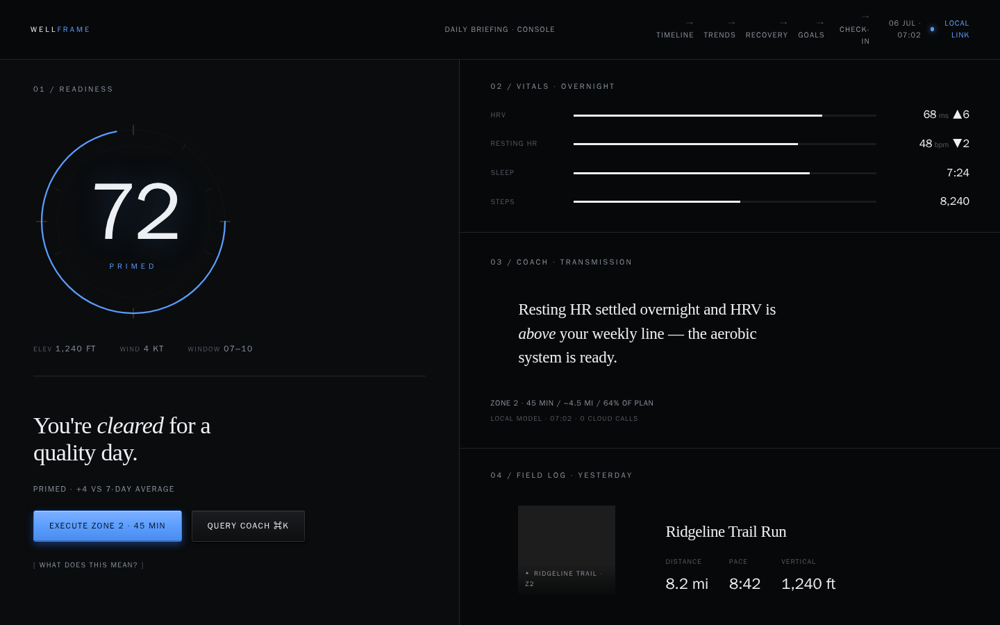
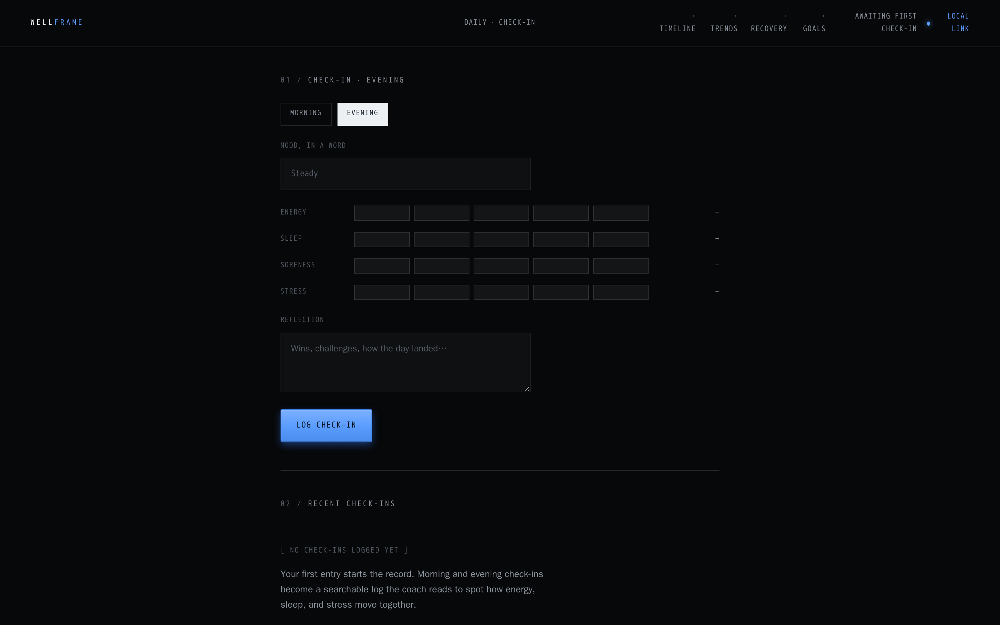
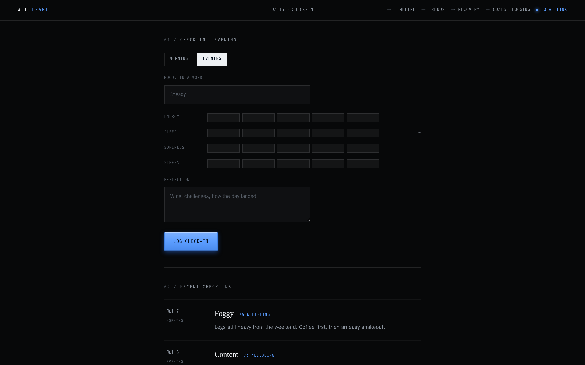

# Wellframe

[](https://github.com/codeyam-ai/wellframe/actions/workflows/desktop-release.yml)
[](https://github.com/codeyam-ai/wellframe/actions/workflows/mcpb-release.yml)

**A privacy-first, local-first AI wellness console — your health data lives on your machine, and a coach that actually understands it lives beside it.**

The Dashboard "Daily Briefing" answers "How am I doing today?" at a glance — a readiness dial, overnight vitals, an observant coach transmission, and yesterday's activity — all read from data on your own machine. The Activity Timeline answers "what have I been doing?" — a day-grouped, filterable feed of workouts, daily briefings, mood check-ins, and body-weight readings, each opening a dedicated detail view.

Four more consoles round out the picture, all in the same deep-ink language and reachable from the top nav: **Trends** charts sleep, HRV, resting heart rate, mileage, and training load across weekly / monthly / yearly ranges; the **Recovery Center** reads those signals into a single recovery score with expandable contributing factors and suggested recovery moves; **Goals** tracks objectives (mileage, races, sleep, strength cadence) as progress rings and lets you create new ones; and the **Daily Check-in** captures a morning or evening snapshot — energy, mood, sleep, soreness, stress, and a reflection — that also lands on the Timeline. Every surface starts empty on day one and fills in as data arrives.

Nothing is uploaded. The data stays in an encrypted SQLite database on your machine, and the AI coach only ever sees what you choose to send it.

<p align="center">
  
</p>

## Install

Wellframe ships as two things, each with its own gated release workflow:

### Desktop app

The Wellframe desktop app (macOS, Windows, Linux) is distributed as installers on
[GitHub Releases](../../releases). Releases are **currently in testing** — to build
and try one right now, or to cut a signed release, see
**[docs/RELEASE.md](docs/RELEASE.md)**. On a Mac you can also run it straight from
source: `cd desktop && npm install && npm run tauri:dev`.

### Wellframe Coach for Claude Desktop (MCP)

[`mcp-server/`](mcp-server/) packages the coach's tools as an installable **`.mcpb`**
— an MCP server that gives Claude Desktop (or any MCP host) **read-only, local**
access to your Wellframe database: readiness, workouts, sleep, training load,
recovery, goals, and daily check-ins. It reads the same `wellframe.db` the desktop
app writes and **uploads nothing**.

```bash
cd mcp-server && npm ci && npm run bundle    # → build/wellframe-coach.mcpb
```

Then drag the `.mcpb` into **Claude Desktop → Settings → Extensions**. Full install
and test steps are in [docs/RELEASE.md](docs/RELEASE.md).

## Tech stack

- **Desktop:** [Tauri 2](https://tauri.app/) + [React](https://react.dev/) + TypeScript + [Vite](https://vitejs.dev/), with TanStack Router/Query, [Tailwind](https://tailwindcss.com/), and [Motion](https://motion.dev/).
- **Storage:** encrypted [SQLite](https://www.sqlite.org/) (SQLCipher) — local-first, no account, no backend.
- **Coach MCP server:** Node + [sql.js](https://sql.js.org/) (WASM, so the `.mcpb` is one portable bundle with no native module), packaged with [`@anthropic-ai/mcpb`](https://www.npmjs.com/package/@anthropic-ai/mcpb).
- **Dev surface:** a [Next.js](https://nextjs.org/) + [Prisma](https://www.prisma.io/) web app is used to author and preview the UI as runnable scenarios with codeyam-editor.
- **Tests:** [Vitest](https://vitest.dev/) (+ Playwright for capture).

## Develop & build locally

The UI is authored against a live preview through the Next.js dev surface, then
wrapped by the Tauri desktop shell.

```bash
# 1. Web console (dev surface) — install, set up the local DB, run
npm run setup        # install + db:push + db:seed
npm run dev          # http://127.0.0.1:3000

# 2. Desktop app (Tauri) — run the shipped shell
cd desktop && npm install && npm run tauri:dev

# 3. Coach MCP server — build the installable bundle
cd mcp-server && npm ci && npm run bundle
```

Common scripts:

| Script | Description |
| --- | --- |
| `npm run dev` | Start the dev server (127.0.0.1:3000) |
| `npm run build` | Production build of the web surface |
| `npm run test` | Run tests (Vitest) |
| `npm run db:push` / `db:seed` / `db:reset` | Sync / seed / reset the local dev database |
| `cd desktop && npm run tauri:dev` | Run the desktop app from source |
| `cd desktop && npm run tauri:build` | Build a local desktop installer |
| `cd mcp-server && npm run bundle` | Build + smoke-test + sign the `.mcpb` |

Releasing (desktop installers and the `.mcpb`) is fully documented, including a
safe dry-run you can rehearse without publishing, in
**[docs/RELEASE.md](docs/RELEASE.md)**.

<!-- codeyam:run-and-edit:start -->
## Develop this project with codeyam-editor

This project is built with [codeyam-editor](https://codeyam.com) — code and runnable data scenarios are authored side by side against a live preview.

```bash
# Launch the editor (split-screen terminal + live preview)
codeyam-editor editor

# Run the app
npm run dev

# Run the tests
npx vitest run
```
<!-- codeyam:run-and-edit:end -->

<!-- codeyam:scenario-gallery:start -->
## Scenario gallery

States captured as runnable scenarios with codeyam-editor:

### Check-in - Day One



### Check-in - Logging



### Dashboard - Connections Setup


### Dashboard - Day One Empty


### Dashboard - Day One Setup


### Dashboard - Low Readiness


### Dashboard - No Workout Yesterday


### Dashboard - Partial Data


<!-- codeyam:scenario-gallery:end -->
