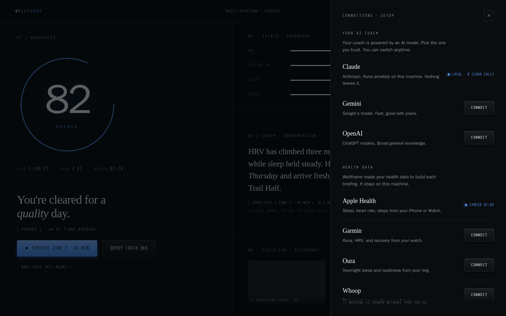
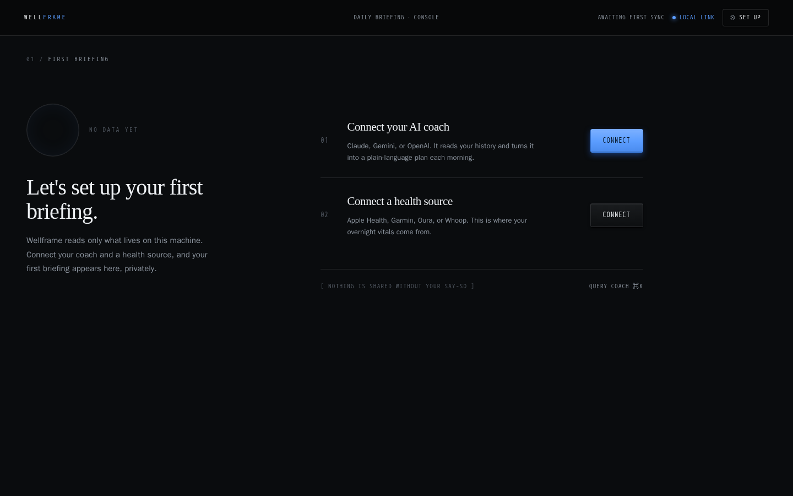
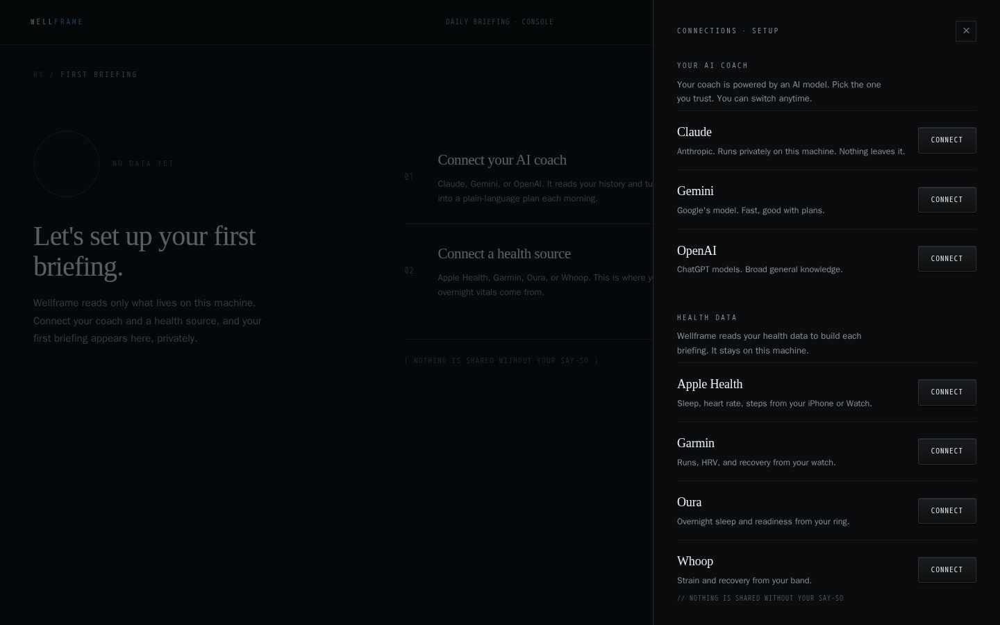
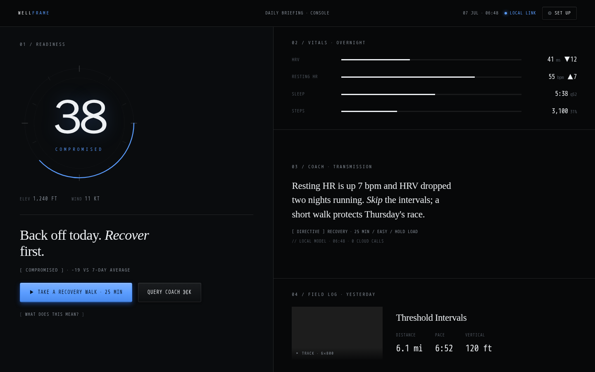
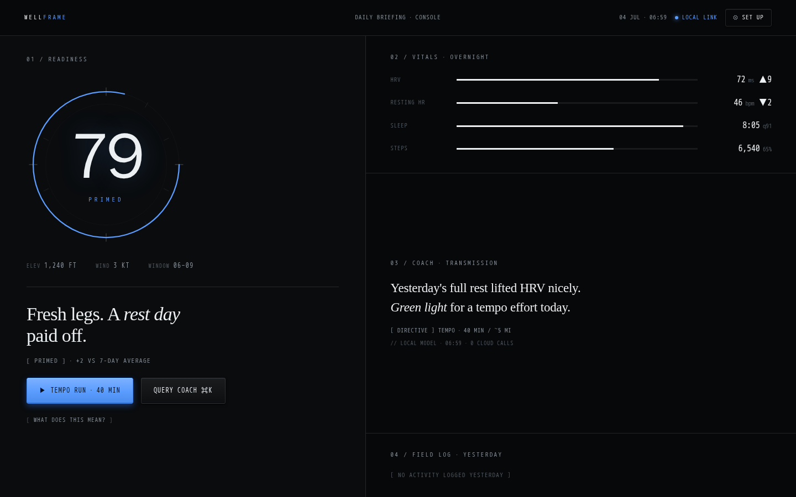
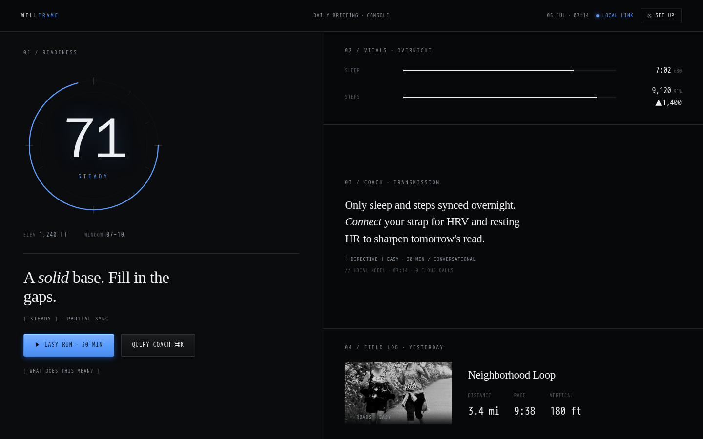
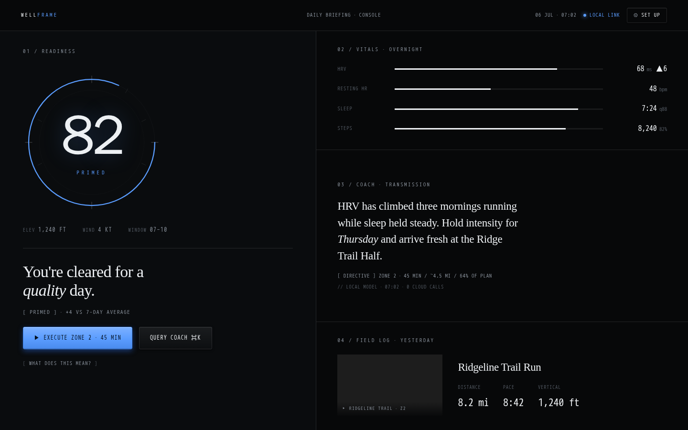

# Wellframe

A privacy-first, local-first AI wellness console. The Dashboard "Daily Briefing" answers "How am I doing today?" at a glance — a readiness dial, overnight vitals, an observant coach transmission, and yesterday's activity — all read from data on your own machine.

## Setup

Run the setup script to install dependencies, initialize the database, and seed it with demo data:

```bash
npm run setup
```

## Development

Start the dev server:

```bash
npm run dev
```

Open [http://localhost:3000](http://localhost:3000) in your browser.

## Using CodeYam Editor

This project was built with [CodeYam](https://codeyam.com). To launch the editor:

```bash
codeyam editor
```

The editor provides a live preview alongside a Claude Code terminal for iterating on the app.

## Database

This project uses SQLite via Prisma. Common commands:

```bash
npm run db:push    # Apply schema changes and generate Prisma client
npm run db:seed    # Seed the database with demo data
npm run db:reset   # Reset database: drop, recreate, and re-seed
```

## Scripts

| Script             | Description                                  |
| ------------------ | -------------------------------------------- |
| `npm run setup`    | One-line project setup (install + db + seed) |
| `npm run dev`      | Start the development server                 |
| `npm run build`    | Build for production                         |
| `npm run test`     | Run tests                                    |
| `npm run db:push`  | Apply Prisma schema changes                  |
| `npm run db:seed`  | Seed the database                            |
| `npm run db:reset` | Reset and re-seed the database               |

<!-- codeyam:run-and-edit:start -->
## Develop this project with codeyam-editor

This project is built with [codeyam-editor](https://codeyam.com) — code and runnable data scenarios are authored side by side against a live preview.

```bash
# Launch the editor (split-screen terminal + live preview)
codeyam-editor editor

# Run the app
npm run dev

# Run the tests
npx vitest run
```
<!-- codeyam:run-and-edit:end -->

<!-- codeyam:scenario-gallery:start -->
## Scenario gallery

States captured as runnable scenarios with codeyam-editor:

### Dashboard - Connections Setup



### Dashboard - Day One Empty



### Dashboard - Day One Setup



### Dashboard - Low Readiness



### Dashboard - No Workout Yesterday



### Dashboard - Partial Data



### Dashboard - Primed Briefing


<!-- codeyam:scenario-gallery:end -->
